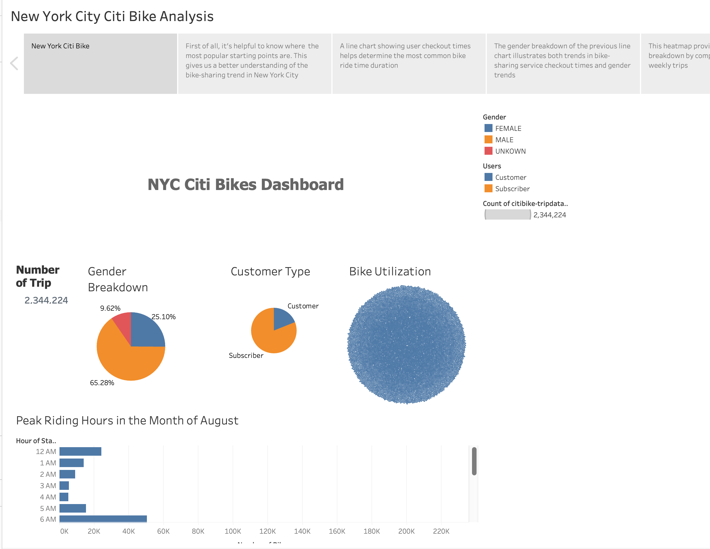
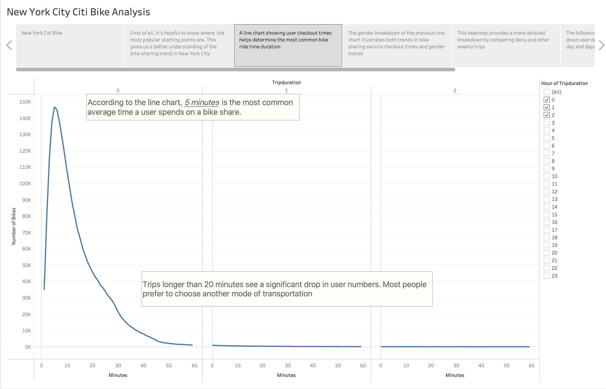
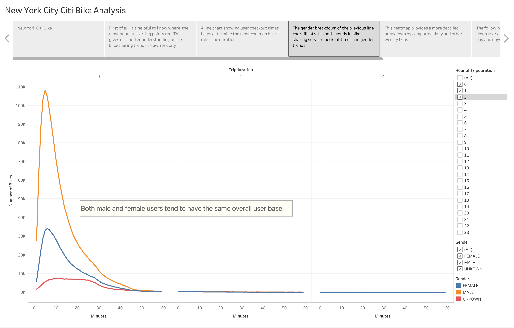
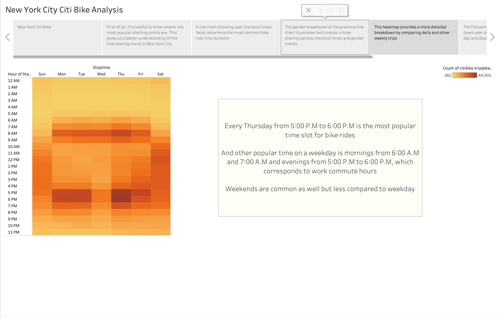
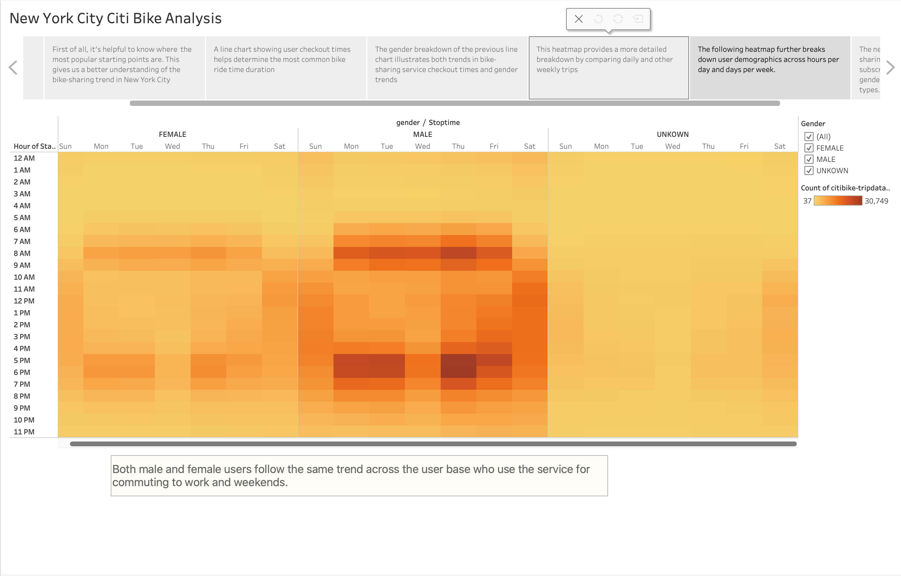
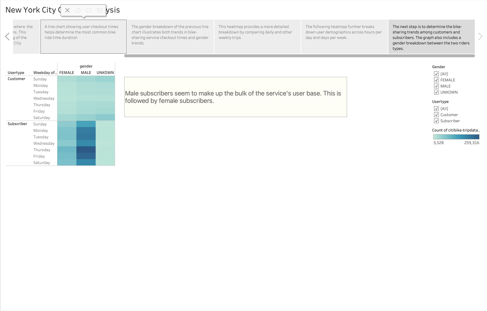

# bikesharing

Tableau Deployed Story : [Click Here](https://public.tableau.com/views/NYCbike_16788794851760/NewYorkCityCitiBikeAnalysis?:language=en-US&:display_count=n&:origin=viz_share_link)

___

## Overview of Analysis

The purpose of this analysis is to develop a proposal to help investors support the Des Moines, Iowa bike-sharing program. Given the dataset, we were able to visualize and see trends in mean cycling time and the relationship between gender and general cycling time. In particular, this set of visualizations:

- Shows how long the bike has been checked out for every rider and gender
- Shows bike rides for all riders and gender by hour by day of the week
- Shows user type by day of the week and number of bike rides by gender. 

___

## Results

The results of the analysis and visualizations are shown below:

___
## Summary

Based on our analysis, we can conclude that many of these users are likely commuters rather than tourists and that most of the peak hours are around morning and evening commuters. Also, most of the users were male drivers. This may not matter, but it will help in future marketing campaigns. Another important point is that most ride times peaked around 5 minutes. If a bike-sharing program were to be established in Des Moines, it would be convenient if each station could be set up within 10 minutes by bike. This is because New York is a big city, while Des Moines is mostly a suburb. Suburbs tend to be more remote than big cities. 